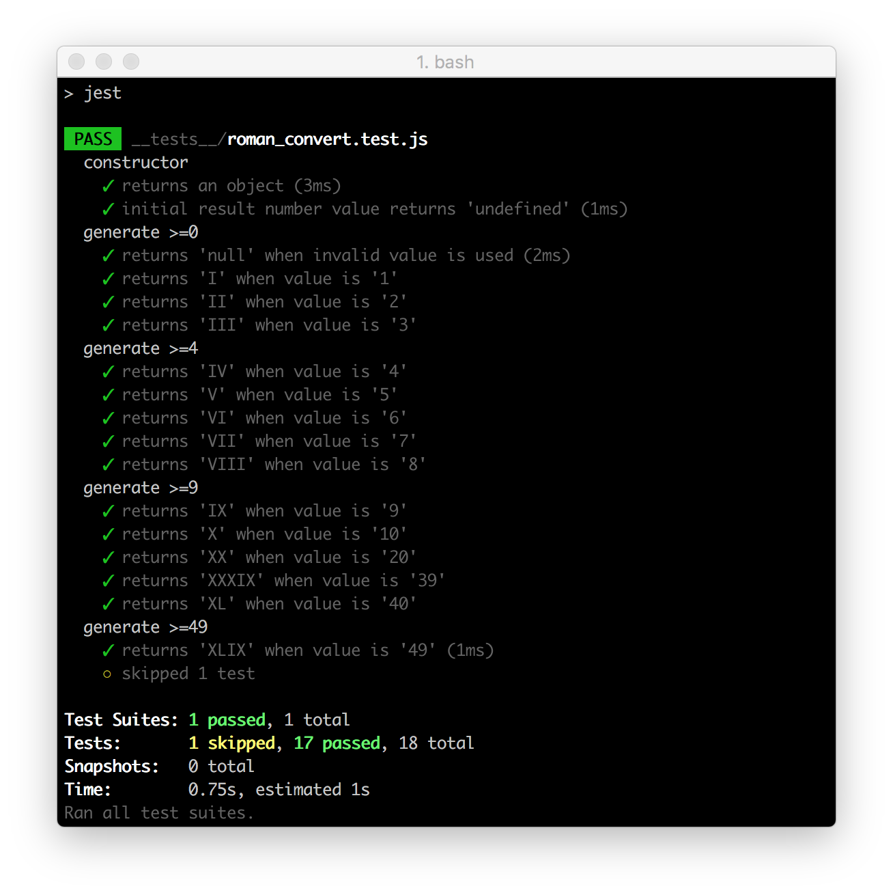

# Coding Kata - Roman Numerals - TDD

Creating a function that converts an integer to its Roman numeral equivalent using TDD (Test-driven Development) approach. Particularly interested in the following:
- Code quality
- Code readability
- Testing (TDD approach)

Write a class that implements the following interface (example given in Java/JavaScript):
```java
public interface RomanNumeralGenerator {
    public String generate(int number);
    }
```
```js
class RomanNumeralGenerator {
  constructor(number) {
    this.number = number;
  }
  generate() {
  }
};
```
Only support numbers between 1 and 3999 and see the following sample inputs and outputs:
```bash
1 = “I”,
5 = “V”,
10 = “X”,
20 = “XX”,
3999 = “MMMCMXCIX”.
```

#### Built with
* [npm](https://www.npmjs.com/) - Node Package Manager
* [Jest](https://facebook.github.io/jest/) - JavaScript Testing Framework
* [Webpack](https://www.npmjs.com/package/webpack-dev-server) - Updates the browser on changes
* [Babel](https://babeljs.io/) - Convert JSX syntax and strip out type annotations

#### Installation
To run this project you will need to download it onto your local machine and install all dependencies.
Navigate inside the folder and enter the following command on your terminal window:
```bash
# install all dependencies
npm install
# run the test
npm test
```

### Approach
<b>First Commit:</b> Used a [boilerplate](https://github.com/MCRcodes/react-bootstrap.git) which already has Jest test framework set up for ES6 with Babel solving any compatibility issue. Created a unit tests to check both `RomanNumeralGenerator` function and `number` property are functioning correctly. And created a simple function currently returning `I` number value.

<b>Second Commit:</b> Tidied up test units for the constructor, and also support for numbers between 1 and 5. The function itself has been expanded to support number value up to 5, resulting in all passes for the test units.

<b>Third Commit:</b> Refactor both the test units and the `RomanNumeralGenerator` function which include replacing multiple if statements for value between 1 to 3 with one if statement since these value only uses one character `I`.

<b>Fourth Commit:</b> The function now supports number value up to 39, test units divided for easier reading. May need to refactor the core function which is getting unnecessarily large, looking into other conditions, specifically `while` and `for` loops.

<b>Fifth Commit:</b> Refactor the core function with `for` loops which will compare the input data with an array of numbers and then return roman character for each condition. Test Units also need adjustment to work with the revised function.

### Further Reading
For an in-depth description of [Roman Numerals](http://en.wikipedia.org/wiki/Roman_numerals)
