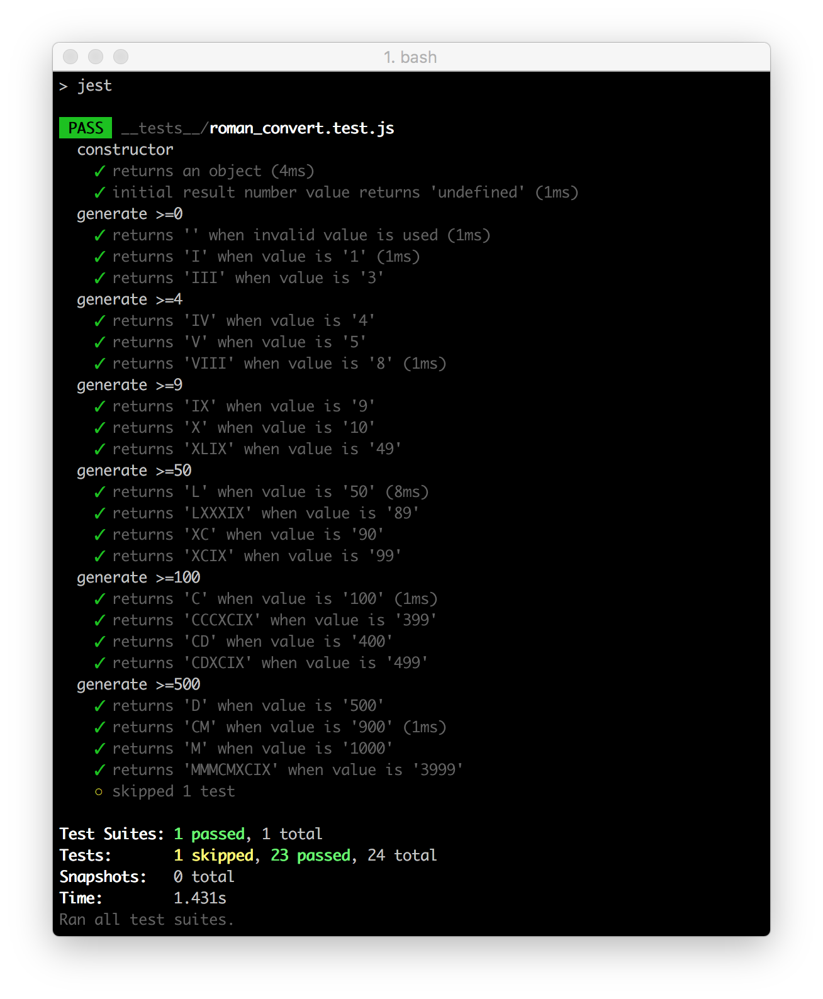

# Coding Kata - Roman Numerals - TDD

Creating a function that converts an integer to its Roman numeral equivalent using TDD (Test-driven Development) approach. Particularly interested in the following:
- Code quality
- Code readability
- Testing (TDD approach)

Write a class that implements the following interface (example given in Java/JavaScript):
```java
public interface RomanNumeralGenerator {
    public String generate(int number);
    }
```
```js
class RomanNumeralGenerator {
  constructor(number) {
    this.number = number;
  }
  generate() {
  }
};
```
Only support numbers between 1 and 3999 and see the following sample inputs and outputs:
```bash
1 = “I”,
5 = “V”,
10 = “X”,
20 = “XX”,
3999 = “MMMCMXCIX”.
```

#### Built with
* [npm](https://www.npmjs.com/) - Node Package Manager
* [Jest](https://facebook.github.io/jest/) - JavaScript Testing Framework
* [Webpack](https://www.npmjs.com/package/webpack-dev-server) - Updates the browser on changes
* [Babel](https://babeljs.io/) - Convert JSX syntax and strip out type annotations
* [boilerplate](https://github.com/MCRcodes/react-bootstrap.git) - Frontend React Bootstrap

#### Installation
To run this project you will need to download it onto your local machine and install all dependencies.
Navigate inside the folder and enter the following command on your terminal window:
```bash
# install all dependencies
npm install
# run the test
npm test
# run the app
npm start
```

### Further Reading
- [MathsIsFun - Roman Numerals](https://www.mathsisfun.com/roman-numerals.html)
- [Wikipedia - Roman Numerals](http://en.wikipedia.org/wiki/Roman_numerals)
